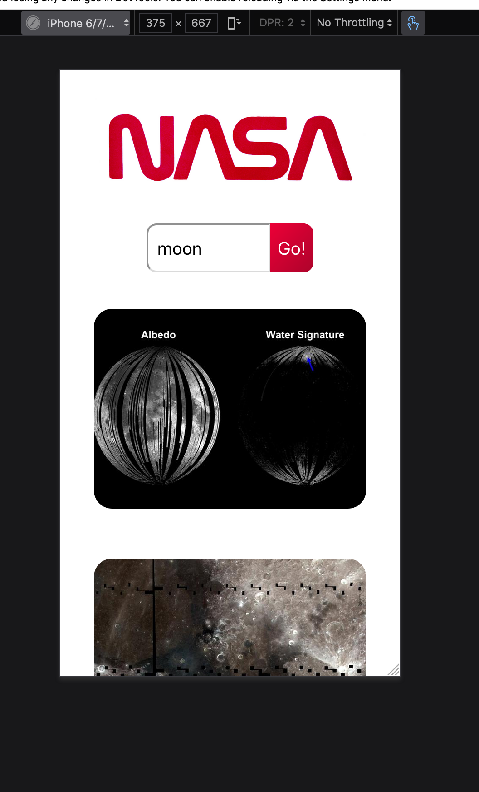
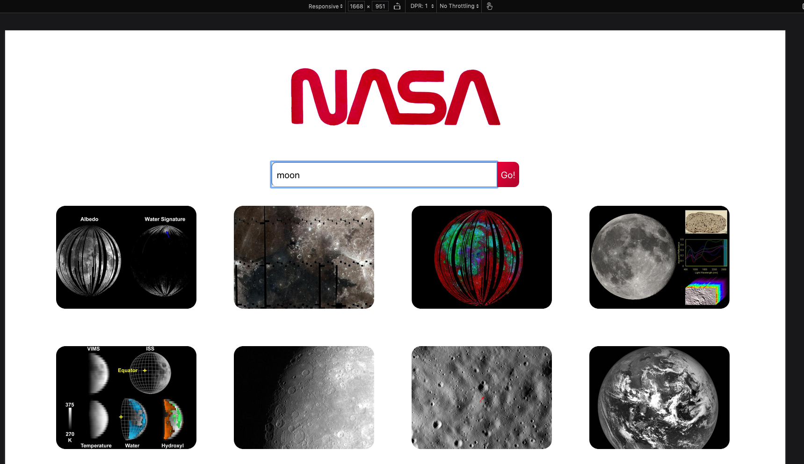

## React Technical Test

Author: Justin Sandahl

### The Brief

Build a React web application that allows users to search for images based on a query relating to space using the NASA API endpoint for image search.

The following functionalities need to be implemented:
- A Search page which allows users to search for images by keyword
- Images must be returned upon a successful search

## Sample Screenshots
Mobile: 
Full-Desktop: 

## Tools Used

Built using:

### React

Testing utilites used:

### Jest & React Testing Library

Packages used:

### Axios, PropTypes, gh-pages

## How to run

Clone down the repo 

` git clone git@github.com:jdsandahl/tech-test.git `

To run the development server:

` npm start `

To run the testing suite: 

` npm test `

## What would be added with more time available

Pagination could be implemented so that rather than displaying all search results there could be a truncated amount of images diplayed.

More robust testing could be created, in particular concerning more robust mock testing regarding the api requests. 

Although a combination of css-Grid and Flex elements have been used, more precise responsiveness could be implemented, currently there are three breakpoint sizes accounted for: max-width 1530px, 760px and 500px.  